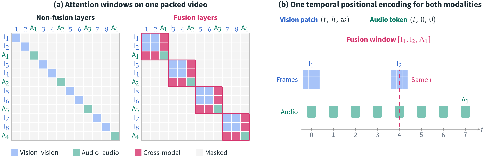
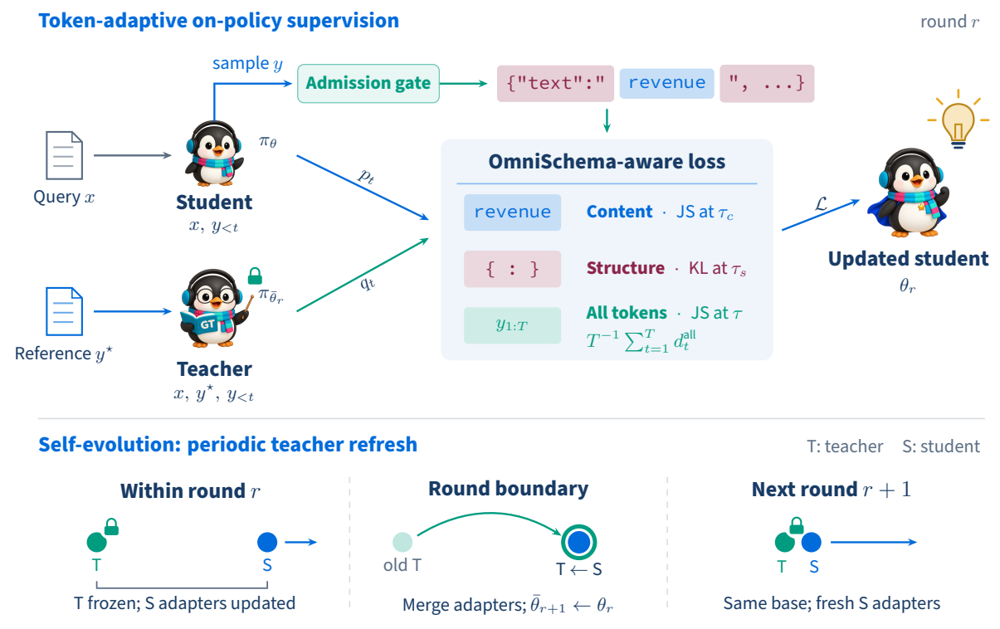

<div align="center">

<p align="center">
    
</p>

<p align="center"><b>One model that parses documents, images, charts, geometry, audio and video into structured JSON</b></p>

<!-- Quick Links -->
<p align="center">
    <a href="https://github.com/TencentCloudADP/youtu-parsing/blob/main/LICENSE"><b>📄 License</b></a> •
    <a href="#"><b>📑 Technical Report (coming soon)</b></a> •
    <a href="#quick-start"><b>🚀 Quick Start</b></a> •
    <a href="#results"><b>📊 Results</b></a> •
    <a href="https://huggingface.co/tencent/Youtu-Parsing-Omni"><b>🤗 Models</b></a> •
    <a href="#citation"><b>📚 Citation</b></a>
</p>

</div>

## News

- **[TBD]** Open-source evaluation code will be released.
- **[2026-10]** [Technical report](paper/Youtu_Parsing_Omni.pdf), model weights, vLLM plugin and inference examples released.

## Introduction

**Youtu-Parsing-Omni** is a compact (5B) omni-modal parsing model. Given a single
input — a document page, a natural image, a chart / flowchart, a geometry
figure, an audio clip or an audio-visual video — it produces one structured
JSON envelope that covers both **perception** (layout elements, text, tables,
formulas, bounding boxes, timestamps, ASR, OCR, acoustic events, camera motion)
and **cognition** (captions, narratives, reports). The output family is
selected by the task prompt (`--task` in the examples, keys of
[`prompts/youtu_parsing_omni.json`](prompts/youtu_parsing_omni.json)).

| Input           | `--task`             | `modality` / `subtype`      | Key contents                                                                                                |
| --------------- | -------------------- | --------------------------- | ----------------------------------------------------------------------------------------------------------- |
| Document page   | `document`           | `image` / `document`        | layout elements with bbox, text / LaTeX / OTSL tables / Markdown charts / Mermaid flowcharts, reading order |
| Natural image   | `natural_image`      | `image` / `natural_image`   | entities and text with bbox, tags, captions, global description                                             |
| Chart           | `graphics_chart`     | `image` / `document`        | one `chart` element: Markdown table, notes, caption                                                         |
| Flowchart       | `graphics_flowchart` | `image` / `document`        | one `flowchart` element: Mermaid, caption                                                                   |
| Geometry figure | `graphics_geometric` | `image` / `document`        | one `geometric` element: points, lines, arcs, shapes, geometric relations and measurements                  |
| Audio           | `audio`              | `audio` / –                 | vocal / non-vocal segments with timestamps, speakers, ASR, timbre / scene captions, acoustic events         |
| Natural video   | `natural_video`      | `video` / `natural_video`   | temporal segments with visual elements, actions, interactions, camera motion, audio track                   |
| Text-rich video | `textrich_video`     | `video` / `text_rich_video` | segments with OCR + ASR and a Markdown `structured_report` of the whole video                               |

Highlights (see the [technical report](paper/Youtu_Parsing_Omni.pdf) for details):

- **Unified schema** – one JSON envelope for seven parsing families, driven by the task prompt.
- **Omni encoder** – image, audio and interleaved audio-visual video inputs (frames + audio track) in a single model.
- **Strong results at a small size** – state-of-the-art on OmniDocBench v1.6 (96.96 Overall), best open-weight model on OmniParsingBench (75.08 Avg., second only to Gemini-3-Pro), and competitive with specialized models on chemical-structure (ChemOCR) and music-score (PDMX-Synth) recognition ([results](#results)).
- **Easy to serve** – a vLLM plugin, pinned serving settings, task prompts and inference examples are included.

## Method

### One encoder for every modality

<p align="center">
    
</p>

Existing omni-modal parsers (a) encode pixels and audio with two separately pre-trained towers whose streams
first meet inside the language model. Youtu-Parsing-Omni (b) replaces both towers with a single
**Youtu-Omni-Encoder**, initialized from a pre-trained text language model to strengthen text reading.
Thin modality-specific stems map pixels and log-mel frames to tokens; a shared bidirectional Transformer
contextualizes an arbitrary packed mix of images, audio chunks and videos under one `(t, h, w)` positional
encoding; modality-specific mergers and projectors then feed the tokens, together with the text prompt, to
the Youtu-LLM decoder, which emits OmniSchema JSON. Only the stems and the merger / projector heads depend
on the modality, so almost all perception parameters are shared.

### Audio-visual fusion inside perception

<p align="center">
    
</p>

The frames and audio chunks of a video are packed in temporal order. (a) A non-fusion layer gives every frame
and every audio chunk its own attention window, while a few **fusion layers** start a new window at every
audio-to-frame boundary, so a frame attends to the sound of the same instant. (b) Vision tokens take `t` from
the frame index and `(h, w)` from the patch grid; audio tokens take `t` from their time offset with `h = w = 0`,
so both modalities share one temporal coordinate system. Cross-modal alignment is thus computed inside the
encoder rather than reconstructed by the decoder.

### One schema for every task: OmniSchema-Aware On-Policy Distillation (OSAD)

<p align="center">
    
</p>

All ten parsing tasks share **OmniSchema**, so after SFT and schema-routed RLVR a single self-evolving
post-training procedure, **OSAD**, applies the same token-role-based objective across tasks. The student
samples its own parses; rollouts that pass the admission gate (JSON validity, schema conformance, box syntax,
repetition checks) are scored by a frozen copy of the model that additionally sees the reference parse.
Because every output follows OmniSchema, each token is identified as **content** (Jensen–Shannon divergence)
or **structure** (forward KL at a higher temperature), plus an all-token JS term. At every round boundary the
student's LoRA adapters are merged and the student becomes the next teacher, so the parser and its
supervision co-evolve without a hand-designed reward or a separately trained teacher.

## Model Zoo

| Model              | Parameters | Download                                                                                      |
| ------------------ | ---------- | --------------------------------------------------------------------------------------------- |
| Youtu-Parsing-Omni | 5B         | 🤗[Hugging Face](https://huggingface.co/tencent/Youtu-Parsing-Omni) |

## Results

### OmniDocBench v1.6

| Model                  |    Params |     Overall ↑ |    Text Edit ↓ | Formula CDM ↑ |  Table TEDS ↑ | Table TEDS-S ↑ | Reading Order Edit ↓ |
| ---------------------- | --------: | ------------: | -------------: | ------------: | ------------: | -------------: | -------------------: |
| **Youtu-Parsing-Omni** |        5B |     **96.96** |         0.0271 |         96.80 |         96.79 |      **98.20** |           **0.1104** |
| TeleOCR                |      1.2B |         96.91 |         0.0267 |         96.59 |     **96.82** |          98.18 |               0.1184 |
| OvisOCR2               |      0.8B |         96.47 |     **0.0265** |         97.49 |         94.58 |          96.98 |               0.1120 |
| PaddleOCR-VL-1.6       |      0.9B |         96.34 |         0.0326 |     **97.53** |         94.76 |          97.10 |               0.1278 |
| MinerU2.5-Pro          |      1.2B |         95.75 |         0.0360 |         97.45 |         93.42 |          95.92 |               0.1200 |
| GLM-OCR                |      0.9B |         95.22 |         0.0440 |         97.18 |         92.83 |          95.39 |               0.1330 |
| HunyuanOCR-1.5         |        1B |         94.74 |         0.0390 |         94.50 |         93.67 |          94.71 |               0.1290 |
| Qianfan-OCR            |        4B |         93.90 |         0.0400 |         95.08 |         90.53 |          93.31 |               0.1300 |
| Youtu-Parsing          |      2.5B |         93.74 |         0.0440 |         93.63 |         92.02 |          95.00 |               0.1160 |
| Ovis2.6-30B-A3B        |   30B-A3B |         93.70 |         0.0350 |         95.17 |         89.44 |          92.40 |               0.1350 |
| Logics-Parsing-v2      |        4B |         93.33 |         0.0410 |         95.65 |         88.42 |          91.98 |               0.1370 |
| FireRed-OCR            |        2B |         93.26 |         0.0370 |         95.44 |         88.04 |          91.06 |               0.1310 |
| Gemini-3-Pro           |         – |         92.91 |         0.0640 |         95.99 |         89.15 |          92.96 |               0.1650 |
| dots.ocr               |        3B |         90.77 |         0.0480 |         89.95 |         87.18 |          90.58 |               0.1380 |
| OpenDoc-0.1B           |      0.1B |         90.67 |         0.0490 |         93.02 |         83.88 |          87.45 |               0.1400 |
| DeepSeek-OCR 2         |        3B |         90.25 |         0.0500 |         91.84 |         83.89 |          87.75 |               0.1440 |
| Qwen3-VL-235B          | 235B-A22B |         89.78 |         0.0630 |         92.55 |         83.07 |          86.75 |               0.1660 |
| Dolphin-v2             |        3B |         89.50 |         0.0690 |         91.01 |         84.40 |          87.44 |               0.1500 |
| OCRVerse               |        4B |         88.60 |         0.0630 |         89.61 |         82.44 |          86.27 |               0.1630 |
| MonkeyOCR-pro-3B       |        3B |         88.57 |         0.0740 |         88.74 |         84.35 |          88.62 |               0.1890 |
| GPT-5.2                |         – |         86.59 |         0.1140 |         88.21 |         82.95 |          87.93 |               0.1930 |

### OmniParsingBench

| Model                  |     Chart |  Geometry | Natural Image |     Audio | Natural Video | Text-rich Video |      Avg. |
| ---------------------- | --------: | --------: | ------------: | --------: | ------------: | --------------: | --------: |
| Gemini-3-Pro           |     92.79 | **85.43** |     **69.73** |     76.74 |     **74.82** |       **76.80** | **77.44** |
| **Youtu-Parsing-Omni** | **95.02** |     74.33 |         62.84 | **78.08** |         74.18 |           75.62 |     75.08 |
| Logics-Parsing-Omni    |     94.65 |     76.34 |         67.53 |     75.58 |         67.34 |           65.36 |     72.26 |
| Qwen3-Omni-30B-A3B     |     87.07 |     58.60 |         59.35 |     75.23 |         65.19 |           59.59 |     66.44 |
| Qwen3.5-397B-A17B      |     93.51 |     72.16 |         63.87 |         – |             – |               – |         – |
| GPT-5.4                |     90.92 |     81.16 |         60.50 |         – |             – |               – |         – |


### ChemOCR & PDMX-Synth


**ChemOCR**

| Model                  | Params | Category                 | Avg. Sim. ↑ | Tani@1.0 ↑ |
| ---------------------- | -----: | ------------------------ | ----------: | ---------: |
| DeepSeek-OCR 2         |     3B | General parsing MLLM     |    **74.9** |       49.6 |
| **Youtu-Parsing-Omni** |     5B | Unified parsing MLLM     |        74.6 |   **54.2** |
| ChemDFM-X            |    13B | Chemistry MLLM           |        70.9 |       36.5 |
| GPT-4o                 |      – | Proprietary general MLLM |        36.8 |        3.4 |
| Qwen2.5-VL-7B          |     7B | Open-source general MLLM |        25.5 |        0.4 |
| InternVL2.5-4B         |     4B | Open-source general MLLM |         4.4 |        0.0 |

**PDMX-Synth**

| Model                  | Category                 |     CER ↓ |     SER ↓ |     LER ↓ |
| ---------------------- | ------------------------ | --------: | --------: | --------: |
| **Youtu-Parsing-Omni** | Unified parsing MLLM     | **22.73** |     26.73 |     33.20 |
| LEGATO               | Specialized OMR model    |     23.30 | **25.80** | **31.70** |
| GPT-5.6                | Proprietary general MLLM |     45.02 |     54.74 |     87.52 |
| Gemini-3-Pro           | Proprietary general MLLM |     54.26 |     68.10 |     82.33 |
| Logics-Parsing-Omni    | General parsing MLLM     |     72.44 |     81.93 |     81.34 |
| GOT-OCR2.0             | General parsing MLLM     |     93.98 |     98.54 |     97.76 |


## Quick Start

### 1. Installation

```bash
git clone https://github.com/TencentCloudADP/youtu-parsing.git
cd youtu-parsing/youtu_parsing_omni

# choose one mode per Python environment (Python >= 3.10, CUDA GPUs for inference)
bash scripts/setup_env.sh                 # vLLM serving + plugin (transformers==5.2.0)
bash scripts/setup_env.sh --transformers  # Transformers inference (transformers==5.10.2)
```

- vLLM serving and Transformers inference pin different `transformers` versions
  (`5.2.0` and `5.10.2`); install them into **separate** Python environments.
  `peft` must not be installed in the serving environment (the script removes it).
- `ffmpeg` must be available for audio / video inputs.

<details>
<summary>Manual installation</summary>

```bash
# serving (vllm==0.19.0, transformers==5.2.0)
pip install -r requirements/vllm.txt
pip install transformers==5.2.0   # overrides vllm's transformers<5 pin
pip uninstall -y peft
pip install --no-deps ./vllm-plugin-vita-omni
# Transformers inference (separate env, transformers==5.10.2)
pip install -r requirements/transformers.txt
```

</details>

### 2. Serve with vLLM

```bash
MODEL=tencent/Youtu-Parsing-Omni DATA_ROOT=/path/to/media GPU=0 bash scripts/vllm.sh
```

This starts an OpenAI-compatible server on `http://127.0.0.1:8000/v1` (served model name
`Youtu-Parsing-Omni`) with the [`vllm-plugin-vita-omni`](vllm-plugin-vita-omni) model
implementation and the runtime settings of the reported results.

| Variable    | Default             | Meaning                                                                                  |
| ----------- | ------------------- | ---------------------------------------------------------------------------------------- |
| `MODEL`     | required            | Hugging Face model id (`tencent/Youtu-Parsing-Omni`) or a local checkpoint directory    |
| `DATA_ROOT` | required            | the only directory the server may read local media from (`--allowed-local-media-path`) |
| `GPU`       | `0`                 | GPU the server runs on (`CUDA_VISIBLE_DEVICES`)                                          |
| `PORT`      | `8000`              | port of the server                                                                       |

- Engine settings: `--max-model-len 65536 --max-num-batched-tokens 65536 --max-num-seqs 1`,
  `--gpu-memory-utilization 0.70`, `--limit-mm-per-prompt '{"image": 8, "video": 4, "audio": 8}'`,
  `--seed 1234`, `bfloat16`; vLLM defaults for everything else.
- The server listens on `127.0.0.1` only and runs in the foreground (logs go to the terminal);
  `Ctrl-C` stops it. vLLM's internal port is `30000` (override with `VLLM_PORT`).
- The script also exports the media token budgets read by the plugin
  (`YOUTU_VITA_*`, see [`vllm-plugin-vita-omni`](vllm-plugin-vita-omni/README.md#runtime-knobs)).
- `MODEL` is passed to `vllm serve` as is: `tencent/Youtu-Parsing-Omni` is downloaded from the
  Hugging Face Hub (cached in `HF_HOME`); a local checkpoint directory works as well.

### 3. Parse a file

The media file must lie below `DATA_ROOT`.

```bash
python examples/infer_vllm.py --task document           --media /path/to/media/page.png
python examples/infer_vllm.py --task natural_image      --media /path/to/media/photo.jpg
python examples/infer_vllm.py --task graphics_chart     --media /path/to/media/chart.png
python examples/infer_vllm.py --task graphics_flowchart --media /path/to/media/flowchart.png
python examples/infer_vllm.py --task graphics_geometric --media /path/to/media/geometry.png
python examples/infer_vllm.py --task audio              --media /path/to/media/speech.wav
python examples/infer_vllm.py --task natural_video      --media /path/to/media/clip.mp4
python examples/infer_vllm.py --task textrich_video     --media /path/to/media/lecture.mp4
```

Use `--api-base` to target another server. The task prompts are listed in
[`prompts/youtu_parsing_omni.json`](prompts/youtu_parsing_omni.json).
Requests must put the media **before** the text and enable the parsing mode of
the chat template shipped with the model
(`chat_template_kwargs = {"enable_thinking": false, "enable_parsing": true}`),
which renders the media token directly followed by the prompt, without role markers.
As in the reported results, decoding is greedy, stops at `<|image_pad|>` / `<|end_of_text|>`
(`stop_token_ids`, looked up through the server's `/tokenize` endpoint) and keeps special tokens,
which carry the coordinates.

<details>
<summary>Raw OpenAI API request</summary>

```python
import requests
from openai import OpenAI

# token ids of <|image_pad|> and <|end_of_text|>
stop_token_ids = sorted(requests.post("http://127.0.0.1:8000/tokenize", timeout=60, json={
    "model": "Youtu-Parsing-Omni", "prompt": "<|image_pad|><|end_of_text|>",
    "add_special_tokens": False}).json()["tokens"])

client = OpenAI(base_url="http://127.0.0.1:8000/v1", api_key="EMPTY")
prompt = "Please perform end-to-end document parsing on the provided image. ..."  # see prompts json
response = client.chat.completions.create(
    model="Youtu-Parsing-Omni",
    messages=[{"role": "user", "content": [
        {"type": "image_url", "image_url": {"url": "file:///path/to/media/page.png"}},
        {"type": "text", "text": prompt},
    ]}],
    temperature=0.0,
    max_tokens=32768,
    extra_body={
        "chat_template_kwargs": {"enable_thinking": False, "enable_parsing": True},
        "skip_special_tokens": False,
        "min_tokens": 16,
        "stop_token_ids": stop_token_ids,
    },
)
print(response.choices[0].message.content)
```

Audio files are sent as `audio_url`. For videos send one `file://` `video_url` below
`--allowed-local-media-path` and add
`"mm_processor_kwargs": {"nframes": 64, "use_audio_in_video": true, "use_vision_in_video": true}`
to `extra_body`; the plugin then decodes the audio track together with the frames
(see [Video requests](vllm-plugin-vita-omni/README.md#video-requests)).

</details>

### Transformers

Transformers inference requires `transformers==5.10.2`
(`bash scripts/setup_env.sh --transformers`, in an environment separate from vLLM).
A minimal example is in [`examples/infer_transformers.py`](examples/infer_transformers.py):

```bash
MODEL=tencent/Youtu-Parsing-Omni

python examples/infer_transformers.py --model $MODEL --task document           --media /path/to/media/page.png
python examples/infer_transformers.py --model $MODEL --task natural_image      --media /path/to/media/photo.jpg
python examples/infer_transformers.py --model $MODEL --task graphics_chart     --media /path/to/media/chart.png
python examples/infer_transformers.py --model $MODEL --task graphics_flowchart --media /path/to/media/flowchart.png
python examples/infer_transformers.py --model $MODEL --task graphics_geometric --media /path/to/media/geometry.png
python examples/infer_transformers.py --model $MODEL --task audio              --media /path/to/media/speech.wav
python examples/infer_transformers.py --model $MODEL --task natural_video      --media /path/to/media/clip.mp4
python examples/infer_transformers.py --model $MODEL --task textrich_video     --media /path/to/media/lecture.mp4
```

`--task` takes the same values as `examples/infer_vllm.py` and selects the prompt from
[`prompts/youtu_parsing_omni.json`](prompts/youtu_parsing_omni.json); the media path is not
restricted to a `DATA_ROOT` here. Hub ids are downloaded to `--download-dir`
(default `~/.cache/youtu-parsing-omni`). The model is loaded with
`trust_remote_code=True`, which executes the Python code shipped with the checkpoint; when
`--model` is a Hugging Face Hub id, pin a reviewed commit with `--revision <commit-hash>`.
The reported results were produced with vLLM (`scripts/vllm.sh`).

### Output format

The model answers with one fenced `` ```json `` block. Coordinates are
encoded with dedicated tokens relative to a 0–1000 grid, e.g.
`"bbox": "<box><x_85><y_275><x_1000><y_1000></box>"` (top-left x/y, bottom-right x/y);
timestamps use `HH:MM:SS`. The top-level `modality` / `subtype` pair of each task is listed
in the [Introduction](#introduction); image tasks return `elements` (plus `reading_order` for
document-style outputs), audio and video tasks return temporal `segments`, and every output
has a `global_description`.

```json
{
  "modality": "image",
  "subtype": "natural_image",
  "elements": [
    {"id": "e_000", "category": "entity", "bbox": "<box><x_350><y_465><x_590><y_715></box>",
     "tag": "snake bookmark", "content": {"text": "", "caption": "A silver snake-shaped bookmark ..."}}
  ],
  "global_description": {"caption": "...", "narrative": "...", "scene": "..."}
}
```

## Repository Structure

```text
youtu_parsing_omni/          # youtu-parsing/youtu_parsing_omni
├── vllm-plugin-vita-omni/   # vLLM out-of-tree model plugin of Youtu-Parsing-Omni
│   └── vita_omni/           # config, model, multimodal processor, image / audio / video utils
├── examples/
│   ├── infer_vllm.py        # parse one file with a running vLLM server
│   └── infer_transformers.py  # parse one file with Hugging Face Transformers
├── prompts/
│   └── youtu_parsing_omni.json  # task prompts (one per --task)
├── scripts/
│   ├── setup_env.sh         # environment setup (vLLM / Transformers)
│   └── vllm.sh              # one vLLM server per GPU with the reported settings
├── requirements/            # vllm.txt, transformers.txt
├── paper/
│   └── Youtu_Parsing_Omni.pdf  # technical report
└── assets/                  # logo and README figures
```

## Citation

If you find Youtu-Parsing-Omni useful in your research or applications, please consider citing our work:

```bibtex
@article{youtu-parsing-omni,
  title   = {Youtu-Parsing-Omni: One Encoder, One Schema, Every Modality},
  author={Tencent Youtu Lab},
  journal = {arXiv preprint arXiv:[TBD]},
  year    = {2026}
}

@article{youtu-parsing,
  title={Youtu-Parsing: Perception, Structuring and Recognition via High-Parallelism Decoding},
  author={Tencent Youtu Lab},
  year={2026},
  eprint={2601.20430},
  archivePrefix={arXiv},
  primaryClass={cs.CV},
  url={https://arxiv.org/abs/2601.20430},
}

@article{youtu-vl,
  title={Youtu-VL: Unleashing Visual Potential via Unified Vision-Language Supervision},
  author={Tencent Youtu Lab},
  year={2026},
  eprint={2601.19798},
  archivePrefix={arXiv},
  primaryClass={cs.CV},
  url={https://arxiv.org/abs/2601.19798},
}

@article{youtu-llm,
  title={Youtu-LLM: Unlocking the Native Agentic Potential for Lightweight Large Language Models},
  author={Tencent Youtu Lab},
  year={2025},
  eprint={2512.24618},
  archivePrefix={arXiv},
  primaryClass={cs.CL},
  url={https://arxiv.org/abs/2512.24618},
}
```

## Acknowledgements

We extend our gratitude to the following projects and communities that made Youtu-Parsing-Omni possible:

- [Youtu-VL](https://github.com/TencentCloudADP/youtu-vl)
- [Youtu-LLM](https://github.com/TencentCloudADP/youtu-tip/tree/master/youtu-llm)